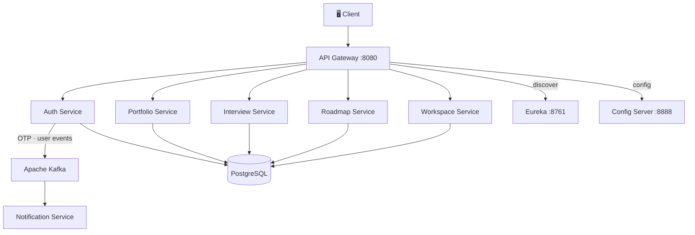

# 🚀 Switchboard - Distributed Backend Platform

## Overview
A production-style distributed microservices backend built to explore
event-driven architecture, horizontal scalability, and full observability.
Processes 500–1,000 domain events/min via Apache Kafka.

`Java 17` `Spring Boot 3` `Apache Kafka` `PostgreSQL` `Docker` `Prometheus` `Grafana`

## Architecture



## Key Technical Decisions
| Decision | Choice | Why |
|---|---|---|
| Event streaming | Apache Kafka | Durable, high-throughput, replay capability |
| Async jobs | RabbitMQ | Per-service job queues, DLQ support |
| Auth | JWT RS256 + OAuth2 + OTP | Stateless, asymmetric — gateway validates locally via JWKS |
| Config | Spring Cloud Config + AWS SSM | Centralized, environment-aware, secret-safe |
| Observability | Prometheus + Grafana + Loki | Metrics, logs, and traces in one stack |

## Performance
- API latency: p95 ~300ms (down from 800ms — 62% reduction)
- Event throughput: 500–1,000 events/min sustained
- All services containerized with Docker Compose

## Services
- `service-discovery` - Eureka server, service registry `:8761`
- `config-server` - Centralized config via Git + AWS SSM `:8888`
- `auth-service` - JWT RS256, OTP, Google OAuth2
- `api-gateway` - Routing, JWT validation, user header injection `:8080`
- `portfolio-service` - User portfolio CRUD, AWS S3 uploads
- `interview-service` - Interview experience sharing, Redis cache
- `roadmap-service` - Goal/task tracking, OpenFeign inter-service calls
- `workspace-service` - Multi-workspace management
- `notification-service` - Kafka consumer, AWS SES + Gmail dispatch
- `common-dto` - Shared Kafka event schemas (GitHub Packages JAR)
- `ui` - React 19 SPA, Tailwind CSS, Google OAuth

## Startup Order
```
1. service-discovery  (Eureka)
2. config-server
3. auth-service + business services  (parallel)
4. api-gateway
5. ui
```

## Local Setup
```bash
git clone https://github.com/vaishali515/switchboard
cd switchboard
docker-compose up -d
```
